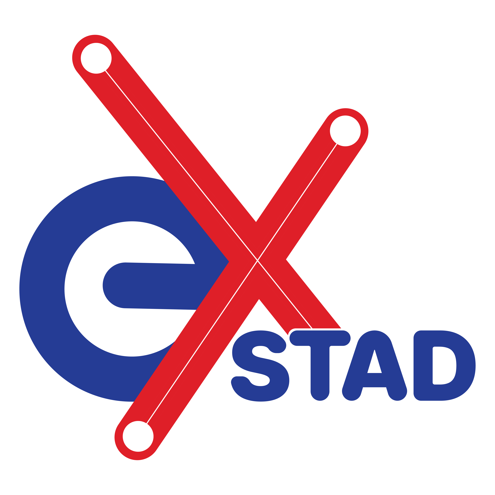

# Welcome to exSTAD

`exSTAD` is a full-stack web application built for Cambodian students to explore ISTAD’s scholarships, courses, projects, and achievements — all in one unified digital platform.

It serves as a portal to share experiences from ISTAD scholars and to connect students directly with ISTAD.
Developed by the 1st Generation Full Stack Web Development Students at the Institute of Science and Technology Advanced Development (ISTAD),
exSTAD reimagines the learning management experience for administrators, instructors, and students alike.

## exSTAD Logo

  

---

## Platform Preview

  
  
  

---
## Introduction 
In today’s digital age, exSTAD transforms how learning and academic management are delivered.
It serves as a centralized platform for managing ISTAD’s study programs — including scholarships, courses, student enrollment, instructor management, and digital verification profiles.

Built proudly by Khmer students, exSTAD strives to make education more accessible, efficient, and engaging for everyone involved.

---

## Background 
The Institute of Science and Technology Advanced Development (ISTAD) provides advanced IT education and scholarships for Cambodian students.
To extend these opportunities and make them more discoverable, our team envisioned exSTAD — a web-based platform that bridges students and ISTAD through technology, enabling them to:

Explore academic programs and scholarships

Enroll seamlessly into study programs

Access academic records and achievements online

Strengthen the connection between students and the institute   

---

## Key Feature

---

## Live Platform

---

## Technology Stack

---

## System Architecture & Selected Technologies

---

## Navigation Structure

---

## 👥 Team Members

| Name                  | Role & Responsibilities                        |
|-----------------------|------------------------------------------------|
| Leng Narak            | Repository setup, Contact Page, About Page     |
| Srun Oudom Sambath    | Program Manangement               |
| Kong Sisovandara      | Backend               |
| Kung Sovannda         | Sign Up and Login Functionality                |
| Tang Menghouy         | Cart and Checkout Implementation               |
| Tong Bora             | Wishlist and Account Management                |
| Chunn Meyling         | Product Detail Page                            |
| Phum Sreynoch         |

---

## Acknowledgement

We extend our heartfelt gratitude to our mentors:

👩‍🏫 Mr. Chan Chhaya and 👨‍🏫 Ms. Eung Lyzhia

Their invaluable guidance, patience, and unwavering support have been instrumental in developing StackQuiz. This project would not have been possible without their dedication and belief in our abilities.

🌟 Thank you for inspiring us to grow as developers!

---

## Conclusion

exSTAD stands as a proud achievement of ISTAD’s first-generation full-stack developers — a platform that unites technology, education, and opportunity.
It represents our commitment to:

Innovation: Modern technologies for modern learning

Growth: Supporting Cambodian students to build IT careers

Accessibility: Making education inclusive and available anytime, anywhere

✨ exSTAD — The Future of Learning Management in Cambodia.

---